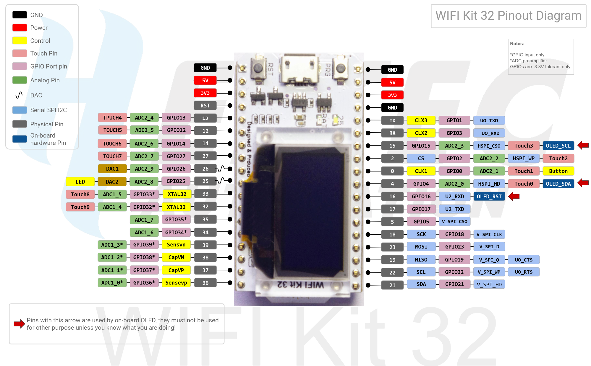

# Balancer - ESP32 based balancing robot
_Brian Erickson_

I started this project as an excuse to play around with the an Heltech ESP32.

The goal is to build a self-balancing two-wheeled robot while learning about the ESP32 along the way.

So far, I haven't built the robot itself, but the project demonstrates:

- Simultaneous WIFI and Bluetooth
- Sleep mode
- Creating virtual buttons with touch inputs
- Displaying output via built in OLED display
- Web server with restful API

# ESP32 Pinout
Image from https://github.com/Heltec-Aaron-Lee/WiFi_Kit_series/blob/master/PinoutDiagram/WIFI%20Kit%2032.pdf

# Electronics
Label | Description
--- | ---
MCU | HELTECH ESP32 with OLED and battery management, see https://heltec.org/project/wifi-kit-32/
MPU | MPU6050
1S | 1s LiPo for controlling the electronics
2S | 2s LiPo for powering the motors
Left | Left motor
Right | Right motor
MCC | Dual HBridge motor controller

# Wiring - Netlist

Net Name | Connections
---|---
GND | MCU.GND MPU.GND B1.GND B2.-
3V3 | MCU.3V3 MPU.3V3 Left.VCC Right.VCC
SDA | MPU.SDA MCU.4
SCL | MPU.SCL MCU.15
MPU_RDY | MPU.INT MCU.2
TCH | MCU.13
PWR | Bat2.+ ESC.+
LEFTM1 | Left.M1 ESC.MotorA1
LEFTM2 | Left.M2 ESC.MotorA2
LEFTC1  | Left.C1 MCU.36
LEFTC2  | Left.C2 MCU.37
RIGHTM1 | RIGHT.M1 ESC.MotorB1
RIGHTM2 | RIGHT.M2 ESC.MotorB2
RIGHTC1  | RIGHT.C1 MCU.38
RIGHTC2  | RIGHT.C2 MCU.39
LEFTA | LEFT.A MCU.34
LEFTB | LEFT.B MCU.35
RIGHTA | RIGHT.A MCU.32
RIGHTB | RIGHT.B MCU.33

